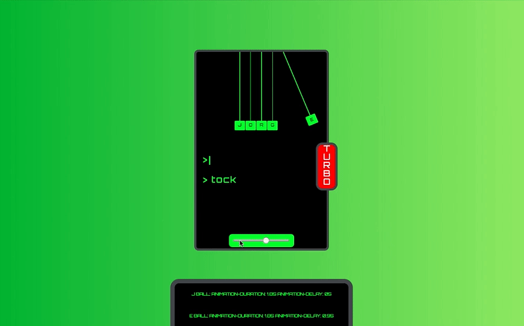

# Digital Newton's Cradle
Hosted Here: https://codepen.io/jnavarr56/pen/YvvKzb.
 
### Description
This is a Digital Newton's Cradle with a speed track bar. 

The basic animation is accomplished by rotating from the top and having one of the moving "stick and ball" structures set to have an animation delay that is equal to half of the animation duration of the other, like so:
```css
.beginning {
  animation: move 1s ease 0.0s infinite; 
}
.end {
  animation: move2 1s ease .5s infinite; 
}
@keyframes move {
  0% {}
  25% {
    transform-origin: top;
    transform: rotate(25deg);
  }
  50% {
    transform-origin: top;
    transform: rotate(0deg);  
  }
}
@keyframes move2 {
  0% {
  }
  25% {
    transform-origin: top center;
    transform: rotate(-25deg);
  }
  50% {
    transform-origin: top center;
    transform: rotate(0deg);
  }
}
```

 